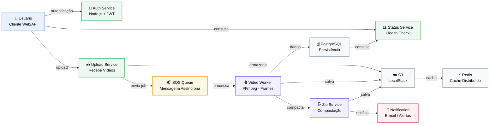

# 🎬 Sistema de Processamento de Vídeos

## 📌 Descrição

Sistema distribuído de processamento de vídeos desenvolvido com arquitetura de microsserviços, capaz de receber vídeos, processar frames, gerar arquivos `.zip` e notificar usuários sobre o status do processamento.

O sistema foi projetado com foco em:

- Escalabilidade
- Resiliência
- Processamento assíncrono
- Automação de deploy (CI/CD)
- Qualidade de código (SonarCloud)

---

### 🏗️ Arquitetura

O sistema segue um modelo **event-driven**, utilizando filas para desacoplamento entre serviços.

# Requisitos Funcionais

• A nova versão do sistema deve processar mais de um vídeo ao mesmo tempo.
• Em caso de picos, o sistema não deve perder uma requisição.
• O Sistema deve ser protegido por usuário e senha.
• O fluxo deve ter uma listagem de status dos vídeos de um usuário.

------

# Requisitos Técnicos

Arquitetura e Infraestrutura
• O sistema deve persistir os dados.
• O sistema deve estar em uma arquitetura que o permita ser escalado.
• O projeto deve ser versionado no Github.
• O projeto deve ter testes que garantam a sua qualidade.
• CI/CD da aplicação.

------
# STACK TECNOLÓGICA

• Containers
• Mensageria
• Banco de Dados
• Monitoramento
• CI/CD

------

### Fluxo principal:
Upload → Fila → Worker → Zip → Notificação → Status

---

## 🧩 Microserviços

| Serviço | Responsabilidade |
|--------|----------------|
| auth-service | Autenticação de usuários (JWT) |
| upload-service | Upload de vídeos e envio para fila |
| video-worker | Processamento de frames |
| zip-service | Geração do arquivo .zip |
| notification-service | Notificação de sucesso/erro |
| status-service | Consulta de status do sistema |

---

## 🧰 Stack Tecnológica

- **Backend:** Node.js
- **Orquestração:** Kubernetes
- **Mensageria:** AWS SQS (LocalStack)
- **Storage:** S3 (LocalStack)
- **Banco:** PostgreSQL
- **Cache:** Redis
- **Containers:** Docker
- **CI/CD:** GitHub Actions
- **Qualidade:** SonarCloud

---

## 🔄 Fluxo do Sistema

1. Usuário envia vídeo via API
2. Upload Service salva no S3
3. Evento é enviado para a fila (SQS)
4. Worker processa o vídeo
5. Zip Service gera arquivo compactado
6. Notification Service envia alerta (mock SES)
7. Status Service permite consulta do progresso

---

## 🔐 Segurança

- Autenticação via JWT
- Secrets gerenciados no Kubernetes
- Análise de segurança com SonarCloud

---

## 📈 Escalabilidade

- HPA para serviços HTTP
- Workers desacoplados via fila
- Escala horizontal suportada

Obs: "O projeto possui Horizontal Pod Autoscaler configurado e operacional. Entretanto, devido aos requisitos funcionais atuais — arquivos limitados a 50 MB e processamento extremamente rápido — a carga gerada não é suficiente para manter pressão de CPU, memória ou fila por tempo suficiente para disparar o scale-up durante a demonstração.
Para demonstrar o scale-up seria necessário alterar artificialmente os requisitos operacionais, por exemplo aumentando significativamente o volume de uploads simultâneos, o tamanho dos vídeos, adicionando atraso proposital no processamento ou reduzindo temporariamente os thresholds do HPA. Como esses cenários não representam a carga real prevista para o sistema, optamos por manter a configuração de produção e demonstrar a capacidade através da configuração do Kubernetes."

kubectl get hpa -n backend

| NAME | REFERENCE | TARGETS | MINPODS | MAXPODS | REPLICAS |
|------|-----------|---------|---------|---------|----------|
| auth-service-hpa | Deployment/auth-service | cpu: 1%/70% | 1 | 3 | 1 |
| upload-service-hpa | Deployment/upload-service | cpu: 0%/70% | 1 | 4 | 1 |
| video-worker-hpa | Deployment/video-worker | cpu: 0%/70% | 1 | 5 | 1 |
| zip-service-hpa | Deployment/zip-service | cpu: 0%/70% | 1 | 4 | 1 |

---

## ♻️ Resiliência

- Retry com backoff
- Dead Letter Queue (DLQ)
- Tolerância a falhas distribuídas

---

## 🚀 CI/CD Pipeline

Pipeline automatizado com:

- Build
- Testes automatizados
- Análise SonarCloud
- Build de imagens Docker
- Push para Docker Hub
- Deploy automático no Kubernetes

---

## 🧪 Testes

- Testes unitários
- Testes de integração (PostgreSQL em container Ambiente de Teste "Stage")
- Validação automática no pipeline

---

## 📡 Endpoint de Status

Endpoint para verificação de saúde do sistema:

GET /status

Exemplo de resposta:

{
  "status": "ok",
  "services": {
    "api": "ok",
    "database": "ok"
  }
}

---

## 🐳 Execuçao Local

docker build -t status-service .
docker run -p 3005:3005 status-service

## ☁️ Deploy

kubectl apply -f k8s/

---

# 🧠 📊 DIAGRAMA DE ARQUITETURA

A seguir, está o desenho da arquitetura do sistema, com os principais componentes e o fluxo entre os serviços:

> Este diagrama representa a visão geral da solução em Kubernetes, incluindo entrada do usuário, camada de autenticação e upload, fila de processamento, workers, compactação, notificações e infraestrutura de persistência.

---
