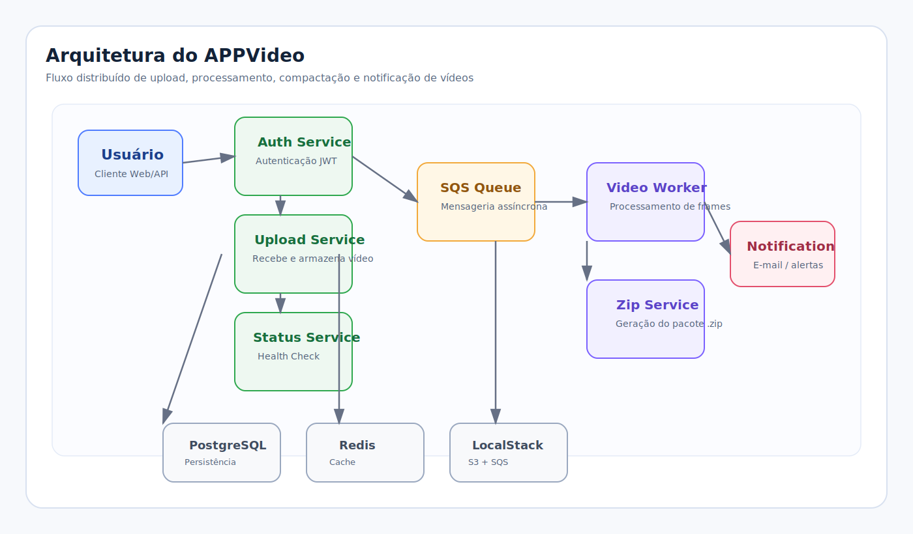

# 🎬 Sistema de Processamento de Vídeos

## 📌 Descrição

Sistema distribuído de processamento de vídeos desenvolvido com arquitetura de microsserviços, capaz de receber vídeos, processar frames, gerar arquivos `.zip` e notificar usuários sobre o status do processamento.

O sistema foi projetado com foco em:

- Escalabilidade
- Resiliência
- Processamento assíncrono
- Automação de deploy (CI/CD)
- Qualidade de código (SonarCloud)

---

### 🏗️ Arquitetura

O sistema segue um modelo **event-driven**, utilizando filas para desacoplamento entre serviços.

# Requisitos Funcionais

• A nova versão do sistema deve processar mais de um vídeo ao mesmo tempo.
• Em caso de picos, o sistema não deve perder uma requisição.
• O Sistema deve ser protegido por usuário e senha.
• O fluxo deve ter uma listagem de status dos vídeos de um usuário.

------

# Requisitos Técnicos

Arquitetura e Infraestrutura
• O sistema deve persistir os dados.
• O sistema deve estar em uma arquitetura que o permita ser escalado.
• O projeto deve ser versionado no Github.
• O projeto deve ter testes que garantam a sua qualidade.
• CI/CD da aplicação.

------
# STACK TECNOLÓGICA

• Containers
• Mensageria
• Banco de Dados
• Monitoramento
• CI/CD

------

### Fluxo principal:
Upload → Fila → Worker → Zip → Notificação → Status

---

## 🧩 Microserviços

| Serviço | Responsabilidade |
|--------|----------------|
| auth-service | Autenticação de usuários (JWT) |
| upload-service | Upload de vídeos e envio para fila |
| video-worker | Processamento de frames |
| zip-service | Geração do arquivo .zip |
| notification-service | Notificação de sucesso/erro |
| status-service | Consulta de status do sistema |

---

## 🧰 Stack Tecnológica

- **Backend:** Node.js
- **Orquestração:** Kubernetes
- **Mensageria:** AWS SQS (LocalStack)
- **Storage:** S3 (LocalStack)
- **Banco:** PostgreSQL
- **Cache:** Redis
- **Containers:** Docker
- **CI/CD:** GitHub Actions
- **Qualidade:** SonarCloud

---

## 🔄 Fluxo do Sistema

1. Usuário envia vídeo via API
2. Upload Service salva no S3
3. Evento é enviado para a fila (SQS)
4. Worker processa o vídeo
5. Zip Service gera arquivo compactado
6. Notification Service envia alerta (mock SES)
7. Status Service permite consulta do progresso

---

## 🔐 Segurança

- Autenticação via JWT
- Secrets gerenciados no Kubernetes
- Análise de segurança com SonarCloud

---

## 📈 Escalabilidade

- HPA para serviços HTTP
- Workers desacoplados via fila
- Escala horizontal suportada

Obs: "O projeto possui Horizontal Pod Autoscaler configurado e operacional. Entretanto, devido aos requisitos funcionais atuais — arquivos limitados a 50 MB e processamento extremamente rápido — a carga gerada não é suficiente para manter pressão de CPU, memória ou fila por tempo suficiente para disparar o scale-up durante a demonstração.
Para demonstrar o scale-up seria necessário alterar artificialmente os requisitos operacionais, por exemplo aumentando significativamente o volume de uploads simultâneos, o tamanho dos vídeos, adicionando atraso proposital no processamento ou reduzindo temporariamente os thresholds do HPA. Como esses cenários não representam a carga real prevista para o sistema, optamos por manter a configuração de produção e demonstrar a capacidade através da configuração do Kubernetes."

kubectl get hpa -n backend

| NAME | REFERENCE | TARGETS | MINPODS | MAXPODS | REPLICAS |
|------|-----------|---------|---------|---------|----------|
| auth-service-hpa | Deployment/auth-service | cpu: 1%/70% | 1 | 3 | 1 |
| upload-service-hpa | Deployment/upload-service | cpu: 0%/70% | 1 | 4 | 1 |
| video-worker-hpa | Deployment/video-worker | cpu: 0%/70% | 1 | 5 | 1 |
| zip-service-hpa | Deployment/zip-service | cpu: 0%/70% | 1 | 4 | 1 |

---

## ♻️ Resiliência

- Retry com backoff
- Dead Letter Queue (DLQ)
- Tolerância a falhas distribuídas

---

## 🚀 CI/CD Pipeline

Pipeline automatizado com:

- Build
- Testes automatizados
- Análise SonarCloud
- Build de imagens Docker
- Push para Docker Hub
- Deploy automático no Kubernetes

---

## 🧪 Testes

- Testes unitários
- Testes de integração (PostgreSQL em container Ambiente de Teste "Stage")
- Validação automática no pipeline

---

## 📡 Endpoint de Status

Endpoint para verificação de saúde do sistema:

GET /status

Exemplo de resposta:


{
  "status": "ok",
  "services": {
    "api": "ok",
    "database": "ok"
  }
}

---

## 🐳 Execuçao Local

docker build -t status-service .
docker run -p 3005:3005 status-service

## ☁️ Deploy

kubectl apply -f k8s/

---

# 🧠 📊 DIAGRAMA DE ARQUITETURA

## 📋 Visão Geral do Sistema

A seguir, está o desenho da arquitetura do sistema, com os principais componentes e o fluxo entre os serviços no ambiente de Desenvolvimento "STAGE"

### 🔵 Diagrama Simplificado




> Estes diagramas representam a visão completa da solução em Kubernetes, incluindo entrada do usuário, camada de autenticação e upload, fila de processamento assíncrono (SQS), workers de processamento de vídeo com FFmpeg, serviço de compactação, notificações e infraestrutura de persistência (PostgreSQL, Redis e S3).

---

### 🧭 C4 - Nível 1 (Contexto do Sistema)

O APPVideo é uma plataforma para upload, processamento e acompanhamento de vídeos. O usuário realiza o envio de arquivos, acompanha o status da operação e recebe notificações por e-mail ao fim do fluxo.

#### 🔷 Diagrama

```text
+----------------------+
|       Usuário       |
| (Envio e acompanhamento) |
+----------+-----------+
           |
           | HTTPS
           v
+-----------------------------------------------+
|                    APPVideo                    |
| Plataforma de upload, processamento e        |
| acompanhamento de vídeos                    |
+------------------+----------------------------+
                   |                            
                   |                            
         +---------+---------+        +---------+---------+
         |                   |        |                   |
         v                   v        v                   v
+----------------+   +----------------+   +----------------+
| Amazon S3     |   | Amazon SQS    |   | Amazon SES    |
| Armazenamento |   | Fila de       |   | Notificações  |
| de vídeos     |   | eventos       |   | por e-mail    |
+----------------+   +----------------+   +----------------+
```

### 🧩 Responsabilidades

- Upload de vídeos
- Processamento assíncrono
- Fragmentação de vídeos
- Geração de arquivos ZIP
- Consulta de status
- Notificações por e-mail

### 🧱 C4 - Nível 2 (Container Diagram)

Os componentes executáveis da solução são organizados em containers que se comunicam por HTTPS, filas e serviços de armazenamento.

#### 🔷 Diagrama

```text
+---------------------------+
|        Usuário            |
+------------+--------------+
             |
             | HTTPS
             v
+-----------------------------------------------+
|        Cloudflare + AWS Application Load Balancer |
+-------------------------+-------------------------+
                          |
                          v
+---------------------------------------------------+
|                Dashboard UI (Frontend)            |
+-------------------------+-------------------------+
                          |
            +-------------+-------------+
            |             |             |
            v             v             v
+----------------+ +----------------+ +----------------+
| Auth Service  | | Upload Service| | Status Service |
+----------------+ +----------------+ +----------------+

                          |
                          v
+---------------------------+
| AWS SQS                  |
| video queue              |
+---------------------------+
                          |
                          v
+---------------------------+
| Video Processor Worker   |
+---------------------------+
                          |
                          v
+---------------------------+
| AWS SQS                  |
| zip queue                |
+---------------------------+
                          |
                          v
+---------------------------+
| Zip Service              |
+---------------------------+
                          |
                          v
+---------------------------+
| Amazon S3                |
+---------------------------+
                          |
                          v
+---------------------------+
| Notification Service     |
+---------------------------+
                          |
                          v
+---------------------------+
| Amazon SES               |
+---------------------------+

+-----------------------------------------------+
| PostgreSQL RDS                                |
| users / videos / jobs / events                |
+-----------------------------------------------+
```

### 🧩 C4 - Nível 3 (Upload Service)

A principal função deste componente é orquestrar o fluxo de negócio de upload, persistência e publicação de eventos.

#### 🔷 Diagrama

```text
+----------------------+
| Upload Controller    |
+----------+-----------+
           |
           +-------------------+
           |                   |
           v                   v
+----------------+   +----------------------+
| PostgreSQL     |   | AWS S3 Raw          |
| metadados     |   | vídeo original      |
+----------------+   +----------------------+
           |
           v
+----------------------+
| SQS Producer         |
| VIDEO_RECEIVED       |
+----------------------+
```

### 🧩 Responsabilidades

- Receber upload
- Persistir metadados
- Registrar job
- Publicar evento VIDEO_RECEIVED
- Enviar vídeo para S3

### 🧩 C4 - Nível 3 (Video Processor Worker)

Este componente consome eventos da fila, processa o vídeo e publica o resultado para o próximo estágio.

#### 🔷 Diagrama

```text
+----------------------+
| Poll SQS            |
+----------+-----------+
           |
           v
+----------------------+
| Download do vídeo   |
| AWS S3 Raw          |
+----------+-----------+
           |
           v
+----------------------+
| FFmpeg              |
| Fragmentação        |
+----------+-----------+
           |
           v
+----------------------+
| Upload fragmentos   |
| AWS S3 Processed    |
+----------+-----------+
           |
           v
+----------------------+
| Evento FRAMES_READY |
+----------------------+
```

### 🧩 C4 - Nível 3 (Zip Service)

Este componente consome os fragmentos processados, gera o arquivo compactado e publica o evento de conclusão.

#### 🔷 Diagrama

```text
+----------------------+
| Consome FRAMES_READY |
+----------+-----------+
           |
           v
+----------------------+
| Download fragmentos  |
+----------+-----------+
           |
           v
+----------------------+
| Geração ZIP         |
+----------+-----------+
           |
           v
+----------------------+
| Upload ZIP no S3    |
+----------+-----------+
           |
           v
+----------------------+
| VIDEO_COMPLETED     |
+----------------------+
```

### 🧩 C4 - Nível 3 (Notification Service)

Este componente consome as notificações da fila e envia mensagens por e-mail para o usuário.

#### 🔷 Diagrama

```text
+----------------------+
| Consome fila         |
| notification         |
+----------+-----------+
           |
           v
+----------------------+
| Template de e-mail   |
+----------+-----------+
           |
           v
+----------------------+
| AWS SES             |
+----------------------+
```

### 📌 Eventos Processados

- VIDEO_RECEIVED
- VIDEO_PROCESSING
- VIDEO_COMPLETED

### 🛠️ Tecnologias Utilizadas

| Categoria | Tecnologia |
|-----------|------------|
| Frontend | HTML + JS |
| Backend | Node.js |
| Banco | PostgreSQL RDS |
| Container | Docker |
| Orquestração | Kubernetes (EKS) |
| Ingress | AWS Load Balancer Controller |
| DNS | Cloudflare |
| Armazenamento | AWS S3 |
| Mensageria | AWS SQS |
| Email | AWS SES |
| Observabilidade | New Relic |
| Processamento de vídeo | FFmpeg |

### 🔄 Fluxo E2E Resumido

```text
Usuário
  ↓
Upload Video
  ↓
Upload Service
  ↓
AWS S3 (RAW)
  ↓
SQS (VIDEO)
  ↓
Video Worker
  ↓
S3 (PROCESSED)
  ↓
SQS (ZIP)
  ↓
Zip Service
  ↓
S3 (ZIP)
  ↓
Notification Service
  ↓
AWS SES
  ↓
Usuário recebe e-mail
```

---

## 📌 Requisitos Não Funcionais

### Escalabilidade

Processamento desacoplado através de filas SQS.
Serviços executados em pods independentes no Amazon EKS.
Capacidade de escalar horizontalmente os Workers.

### Disponibilidade

Balanceamento de carga através do AWS ALB.
Serviços executando em containers Kubernetes.
Armazenamento persistente em Amazon S3 e Amazon RDS.

### Segurança

Autenticação via JWT.
Comunicação HTTPS através de ACM + ALB.
Credenciais armazenadas em Secrets e variáveis de ambiente.
Controle de acesso utilizando IAM Roles.

### Observabilidade

Logs centralizados dos microserviços.
Instrumentação utilizando New Relic.
Monitoramento de filas SQS e processamento de eventos.

## 🧠 Decisões Arquiteturais

### Por que utilizar SQS?

A utilização do Amazon SQS desacopla o upload do processamento de vídeo, permitindo resiliência e escalabilidade.

### Por que utilizar S3?

O Amazon S3 foi utilizado para armazenamento de arquivos brutos, fragmentos processados e arquivos compactados.

### Por que utilizar Kubernetes (EKS)?

O Amazon EKS fornece:

- Orquestração de containers
- Escalabilidade horizontal
- Alta disponibilidade
- Padronização de deploy

## 🔄 Fluxo de Estados do Vídeo

```text
RECEIVED
  ↓
PROCESSING
  ↓
FRAMES_EXTRACTED
  ↓
COMPLETED
```


Em caso de falha:

#### 🔷 Diagrama

PROCESSING
    |
    v
FAILED


Arquitetura Final Implantada

#### 🔷 Diagrama


appvideo.willow.tec.br
     |
     v
AWS ALB
     |
     v
Amazon EKS
  |
  +-- Dashboard UI
  +-- Auth Service
  +-- Upload Service
  +-- Status Service
  +-- Video Worker
  +-- Zip Service
  +-- Notification Service

AWS Services:
  |
  +-- Amazon RDS PostgreSQL
  +-- Amazon S3
  +-- Amazon SQS
  +-- Amazon SES
  +-- AWS ACM